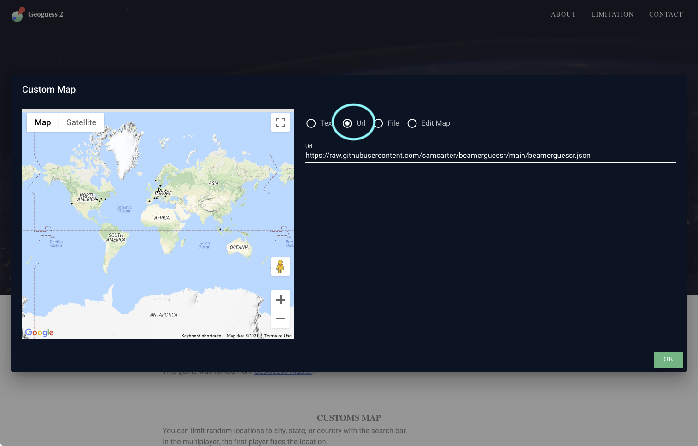

# beamerguessr

This is a custom map for https://geoguessr.tk

Possible locations are all the towns which are namesakes for [LaTeX Beamer themes](https://github.com/josephwright/beamer/tree/main/base/themes/theme) 

To make them easier to recognise, the maps mostly contain the inner parts of the towns. Caveat: Bounderies are only rough approximations, in particular in urban areas with grown together cities, the shape might not follow the actual town boarders.

# How to play?

1. Go to https://geoguessr.tk and click on the little map icon:

2. select `url` and paste `https://raw.githubusercontent.com/samcarter/beamerguessr/main/beamerguessr.json`

3. press the `single player` button

4. press `next`

5. Now you are ready to play. Use your mouse to navigate through the city. To place your guess, select the desired location on the small map at the bottom left and press `guess`

